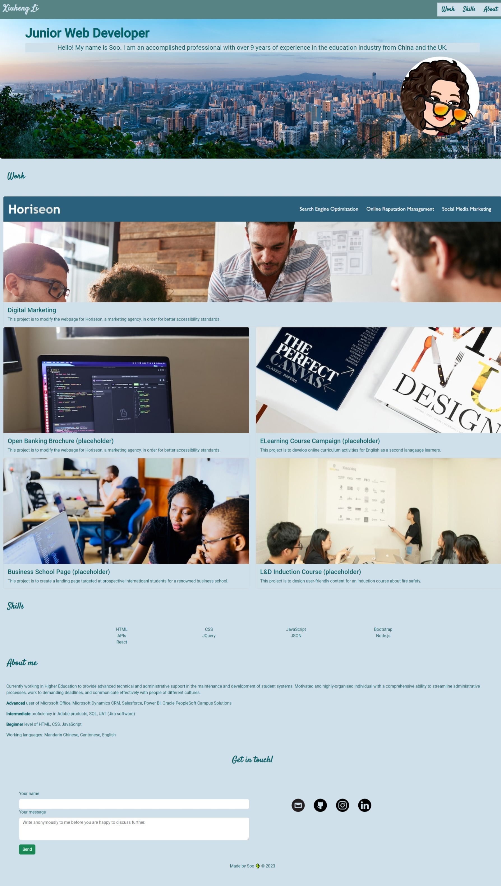
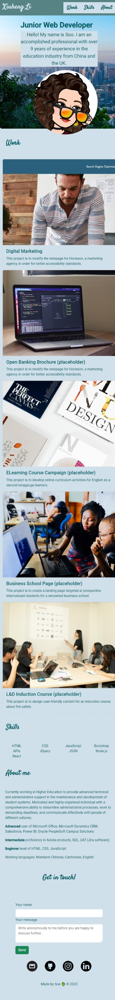

# Module Challenge – Bootstrap Portfolio
## Description
This project is to recreate the portfolio from previous module challenge using Bootstrap CSS Framework.

As I mentioned in the previous project, I wasn’t capable of using my existing knowledge to build a portfolio with fully responsive content. I’m glad that this week we were able to learn Bootstrap, which led to a more efficient and foolproof solution. When I was in class, my impression about Bootstrap Cards was less useful – I didn’t think there are many elements in a webpage that can actually adopt the component, as long as we modify the design and make it less ‘Bootstrap-y’.

Instead of relying heavily on CSS stylesheet, I looked more at the Class tag within the HTML file this time. The biggest difficulty during this challenge was that I had to fit the images into the card body, despite they have different ratios. It took me some time to figure out that we can apply .h-100 class to make all cards equal in size. Meanwhile I also learned that without .h-100 class we can make a grid gallery, taking advantage of the size/ratio difference of images (something I definitely feel like using in the future).

This week my awareness of committing often has increased, even though the fact that the history (versions) made public to people before delivering the end results is always hell for me and my OCD! Hopefully I become more and more comfortable about it and won’t put weird placeholder content before I am ready to commit :P 

Link to the repository:
https://github.com/leesoohang/Bootstrap-Portfolio.git

Link to the live application:
https://leesoohang.github.io/Bootstrap-Portfolio

Link to the previous deployed application:
https://leesoohang.github.io/module2-portfolio

## Installation
N/A

## Usage
The application can be found as ‘index.html’ under the parent folder in the repository. The pictures used in the application be found in the ‘images’ folder, stylesheet in ‘css’ folder.

The screenshots of the live application:

## Credits
Bootstrap Docs – Card is the most referred to among all components I’ve read:

https://getbootstrap.com/docs/5.3/components/card/

Icons used in the application (free to use):

https://www.iconfinder.com/

Placeholder images used in the application (free to use):

https://unsplash.com/

Color inspirations and palette selected in the application (Tidal Wave):

https://www.canva.com/colors/

Fonts used in the application (Google Fonts):

Roboto: https://fonts.google.com/specimen/Roboto

Satisfy: https://fonts.google.com/specimen/Satisfy
